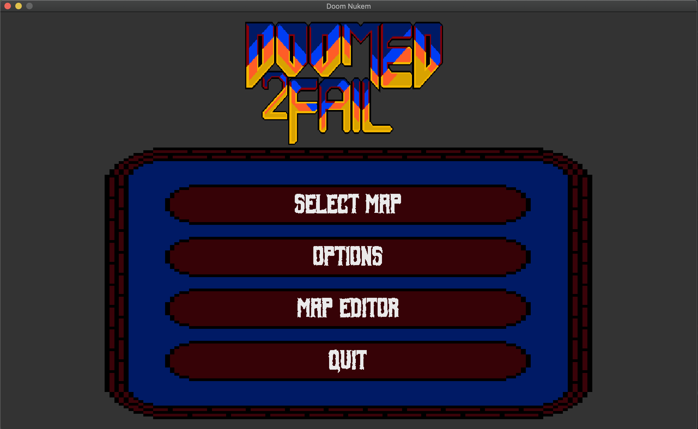
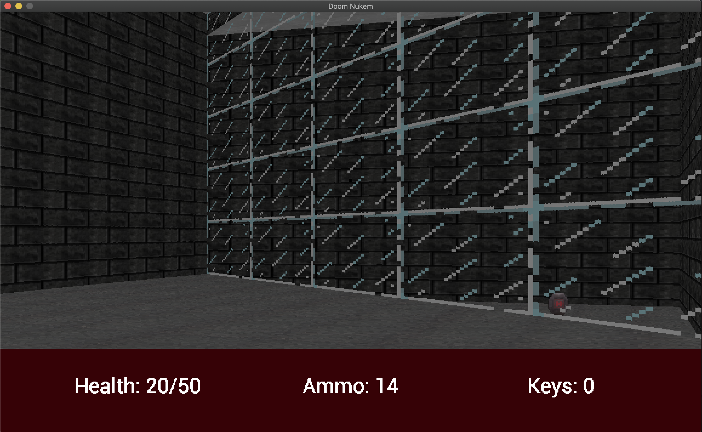

# Doom-Nukem

Doom-Nukem is a Codam project, in which the task is to make a Doom/Duke Nukem 3D engine. Doom-Nukem elaborates on a lot of things introduced in the project right before it: [Wolf3D](https://gitlab.com/Eathox/wolf3d).

The goal of the project is specified in [this subject](https://cdn.intra.42.fr/pdf/pdf/6010/doom-nukem.en.pdf), but what it boils down to is: make a game that is a mix of both Doom and Duke Nukem 3D, and still use the raycast rendering technique. Because the rendering is done with raycasts, the intended FOV is 45. You can change the FOV if you want, but be prepared to see fisheye/visual artifacts when not using the intended 45.

Doom-Nukem is written in purely C and made to work on: Ubuntu, and macOS.

### Features:

- Mouse based camera movement
- Campaign
- Map editor
- FOV, sound, resolution, and sensitivity settings
- Customizable Controls
- Texture packing
- YAML UI config
- Multithreading (Thread Pool)

The map editor saves maps to have predefined names in the format of: `NewMap_<number>`, `<number>` starts at 0 and counts up, you can change the file name after saving the map. The saved maps can be found in the folder: "resources/data/map/custom".

Additional sound effects from www.zapsplat.com

## Dependencies

### Ubuntu

- pkg-config
- libmodplug-dev
- libvorbis-dev
- libmpg123-dev
- libflac-dev
- libopus-dev
- libsdl2-dev
- libsdl2-ttf-dev
- libsdl2-mixer-dev

### macOS

- pkg-config
- libmodplug
- libvorbis
- mpg123
- flac
- opus
- SDL2
- SDL2_ttf
- SDL2_mixer

You can run: `bash ci/install.bash` to install all the dependencies.

## Install

1. Clone this git repo
2. Install the dependencies specified above
3. Run: `make`

## Usage

To start the program simply run: `./doom-nukem`.

Note: In the install process every texture, config, sound/music, and map was packed into `doom-nukem`, once you run the executable it will unpack these again. This means you can move `doom-nukem` anywhere and still run it, this also means that `doom-nukem` will attempt to make a folder called "resources" and put all the textures, etc. in there, therefore its recommended that you still make a separate folder for Doom-Nukem and put the executable in there.
